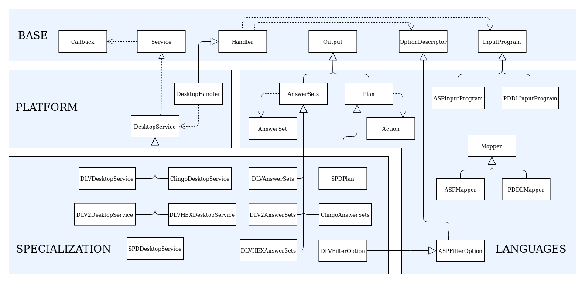

# C# implementation

The following figure provides some details about classes and interfaces of the implementation.

## Base module implementation

Each component in the `Base` module has been implemented by means of abstract class, generic class or interface that will specialize in the following packages.

In particular, the `Handler` class collects `InputProgram` and `OptionDescriptor` objects communicated by the user.

For what the asynchronous mode is concerned, the class `Service` depends from the interface `Callback`, since once the reasoning service has terminated, the result of the computation is returned back via a class `Callback`.

## Platforms module implementation

In order to support a new platform, the `Handler` and `Service` components must be adapted.

For the desktop platform we developed a `DesktopHandler` and a `DesktopService`, which generalizes the usage of a solver on the desktop platform, allowing both synchronous and asynchronous execution modes.

## Languages module implementation

This module includes specific classes for the management of input and output to ASP and PDDL solvers.

The `Mapper` component of the `Languages` module is implemented via a `Mapper` class, that allows to translate input and output into C# objects.
Such translations are guided by [ANTLR4](https://www.antlr.org/) library and **C# Attributes**, a form of metadata that mark C# code and provide information that is not part of the program itself: they have no direct effect on the operation of the code they annotate.

In our setting, we make use of such features so that it is possible to translate facts into strings and vice-versa via two custom attributes, defined according to the following syntax:

* `[Id(string_name)]` : the target must be a class, and defines the predicate name (in the ASP case) and the action name (in the PDDL case) the class is mapped to;
* `[Param(integer_position)]` : the target must be a field of a class annotated via `[Id(string_name)]`, and defines the term (and its position) in the atom (in the ASP case) and in the action (in the PDDL case) the field is mapped to.

By means of the **C# Reflection** mechanism, attributes are examined at runtime, and taken into account to properly define the translation.

If the classes intended for the translation are not annotated or not correctly annotated, an exception is raised.

In addition to the `Mapper`, this module features two sub-modules which are more strictly related to ASP and PDDL.

## Specialization module implementation

The classes `DLVAnswerSets`, `DLV2AnswerSets`, `ClingoAnswerSets`, `DLVHEXAnswerSets` and `SPDPlan` implement specific extensions of the `AnswerSets` or `Plan` classes, in charge of manipulating the output of the respective solvers.

Moreover, this module can contain classes extending `OptionDescriptor` to implement specific options of the solver at hand. 

&nbsp;

&nbsp;

For further information, contact *embasp@mat.unical.it* or visit our [Website](https://www.mat.unical.it/calimeri/projects/embasp/)
