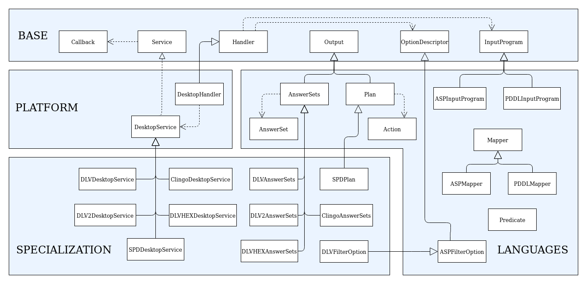

# Python implementation

The following figure provides some details about classes and interfaces of the implementation.

## Base module implementation

Each component in the `Base` module has been implemented by means of generic class or interface that will specialize in the following packages.

In particular, the `Handler` class collects `InputProgram` and `OptionDescriptor` objects communicated by the user.

For what the asynchronous mode is concerned, the class `Service` depends from the interface `Callback`, since once the reasoning service has terminated, the result of the computation is returned back via a class `Callback`.

## Platforms module implementation

In order to support a new platform, the `Handler` and `Service` components must be adapted.

For the desktop platform we developed a `DesktopHandler` and a `DesktopService`, which generalizes the usage of a solver on the desktop platform, allowing both synchronous and asynchronous execution modes.

## Languages module implementation

This module includes specific classes for the management of input and output to ASP and PDDL solvers.

The `Mapper` component of the `Languages` module is implemented via a `Mapper` class, that allows to translate input and output into Python objects.
Such translations are guided by [ANTLR4](https://www.antlr.org/) library and `Predicate` abstract class, also present in the module.

To make possible translate facts into strings and vice versa, the classes that want to represent a predicate, must extend the abstract class `Predicate`, and must be implemented by including the following code:

* `predicateName="string_name"` : must be entered as a class field and must contain the predicate name (in the ASP case) or the action name (in the PDDL case) to map;
* `[("class_field_name_1", int), ("class_field_name_2"), ...]` : Is a list that must be passed to super in the constructor, and must contain so many tuples how many are the class field, containing the field name, sorted by the position of the terms they represent, and optionally the keyword int if the field represents an integer.

Thanks to the structure of the `Predicate` class, this information is passed to the `Mapper` class, to correctly perform the translation mechanism.

If the classes intended for the translation are not constructed correctly in this way, an exception is raised.

In addition to the `Mapper`, this module features two sub-modules which are more strictly related to ASP and PDDL.

## Specialization module implementation

The classes `DLVAnswerSets`, `DLV2AnswerSets`, `ClingoAnswerSets`, `DLVHEXAnswerSets` and `SPDPlan` implement specific extensions of the `AnswerSets` or `Plan` classes, in charge of manipulating the output of the respective solvers.

Moreover, this module can contain classes extending `OptionDescriptor` to implement specific options of the solver at hand. 

&nbsp;

&nbsp;

For further information, contact *embasp@mat.unical.it* or visit our [Website](https://www.mat.unical.it/calimeri/projects/embasp/).
